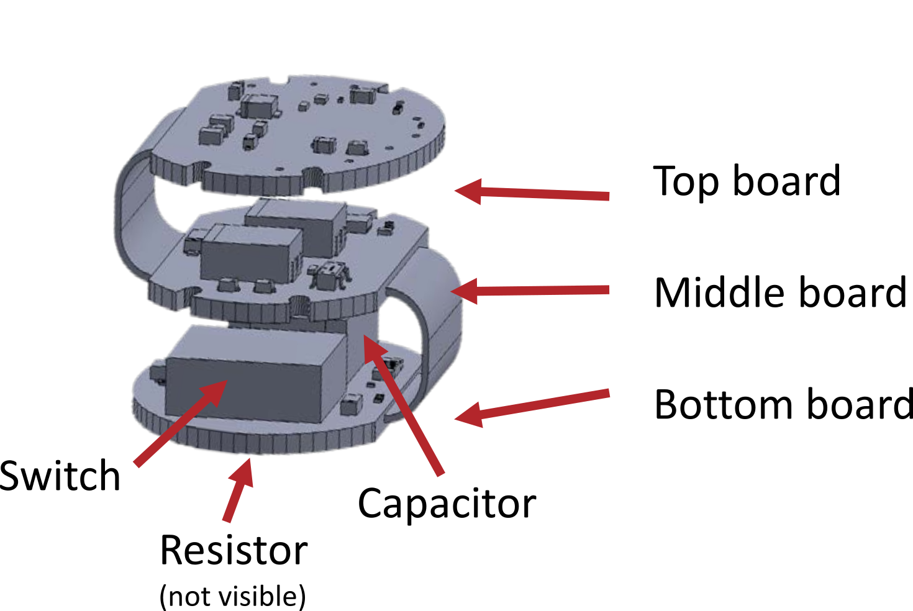
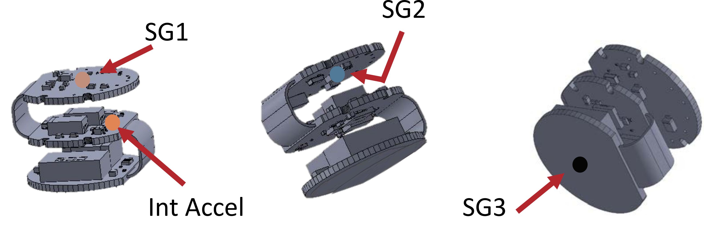
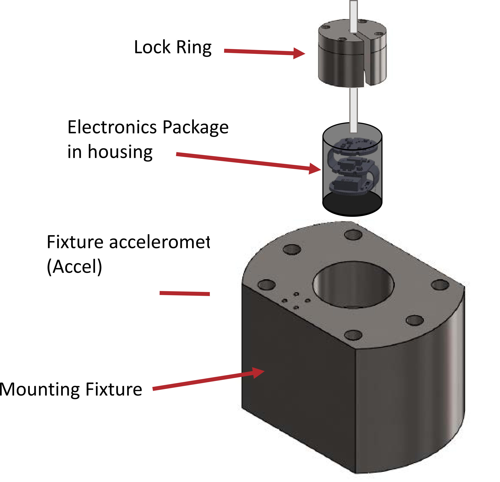
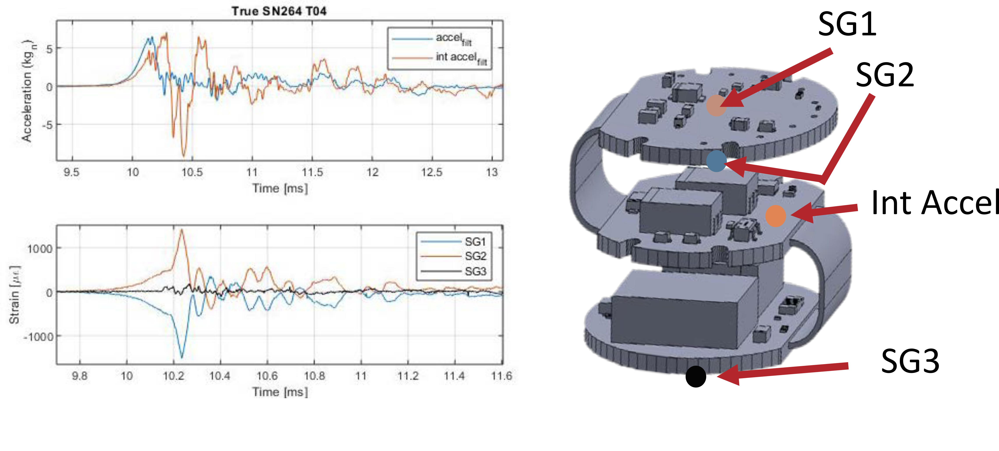

# High-Rate-In-Situ-Damage-of-Electronics-Packages
Drop Tower shock tests of highly-instrumented electronics package

This data set provides a relevant high-rate in-situ data on a highly instrumented electronic assembly under high-level mechanical shock for the development of real-time damage detection and remaining useful life (prognosis) algorithms on electronic systems.

The test article is a three-board electronic assembly with an RC circuit with a switch on the bottom board as shown in figure 1. The goal is the successful discharge of the capacitor. The functionality of the RC circuit was tested after each test.

Figure 1: Experimental three board electronic assembly with an RC circuit.

The electronic assembly is sensors as shown in figure 2 with:
* Accelerometer - Endevco Model 72-60k glued to the top face of the middle board
* Strain gages - HBM Model K-CLY4-0006-1-120-2-005-N
1. SG1 – top face of the top board
1. SG2 – bottom face of the top board
1. SG3 – bottom face of the bottom board

Figure 2: Sensor location for the three board electronic assembly.

The test fixture 

A titanium fixture was used for testing the electronic package on the MTS-66 drop tower. Each unit was unpowered when subjected to a shock. The shock profile was measured by an accelerometer mounted on the fixture and an EndevcoModel 72 accelerometer mounted on the middle board.

Figure 3: Titanium fixture was used for testing the electronic package on the MTS-66 drop tower.

The unit was subjected to the test matrix below.

| Shock ID     | Peak level | Duration |
| ----------- | ----------- | ----------- |
| T04 | 6.5Kg | 0.305 msec
| T04repeat | 7.95Kg | 0.29 msec
| T05 | 14 Kg | 0.22 msec
| T06 | 21 Kg | 0.155 msec
| T07 | 17.55 Kg | 0.13 msec
| T08 | 29.5 Kg | 0.095 msec

The table gives an approximate peak level (data filtered at 50kHz) and approximate duration (defined as the width of the pulse at 10% of the peak). These were extracted from the fixture accelerometer (not the internal accel). The residual strain and accelerometer offset were removed (balanced out) before shock. Before the test series and after each shock, the unit was powered, voltage applied, and the voltage was discharged. The discharge timing and profile were recorded. The units
functioned properly until the final shock when voltage could not be applied correctly. T04repeat test was done immediately after T04 with no changes made to the unit or the test set up.

Results for the first shock test (T04) are shown in figure 4. The PDF titled "High Rate In-Situ Damage_20200429_96TW-2020-0119.pdf" contains a more detailed discussion of the dataset.

Figure 4: Results for the first shock test (T04) and relative sensor locations.

This data set was developed at the AFRL to be shared with academic collaborators to provide relevant high-rate in-situ data on a highly instrumented electronic assembly under high-level mechanical shock for the development of real-time damage detection and remaining useful life (prognosis) algorithms on electronic systems. The PDF titled "High Rate In-Situ Damage_20200429_96TW-2020-0119.pdf" contains a more detailed discussion of the dataset. 

Published as DISTRIBUTION A: Approved for public release; distribution unlimited (96TW-2020-0119)

Cite this data as: 

Alain Beliveau, Jonathan Hong, Jacob Dodson, and Michael Davies, “Dataset-3-high-rate-in-situ-damage-of-electronicspackages,” 2020. [Online]. Available: https://github.com/High-Rate-SHM-Working-Group/Dataset-3-High-Rate-In-Situ-Damage-of-Electronics-Packages

@Misc{Beliveau2020Dataset3High,  
  author = {Alain Beliveau and Jonathan Hong and Jacob Dodson and Michael Davies},  
  title  = {Dataset-3-High-Rate-In-Situ-Damage-of-Electronics-Packages},  
  year   = {2020},  
  groups = {High-Rate-SHM-Working-Group},  
  url    = {https://github.com/High-Rate-SHM-Working-Group/Dataset-3-High-Rate-In-Situ-Damage-of-Electronics-Packages},  
}  